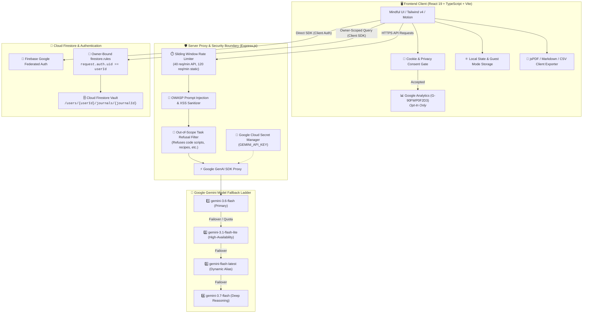
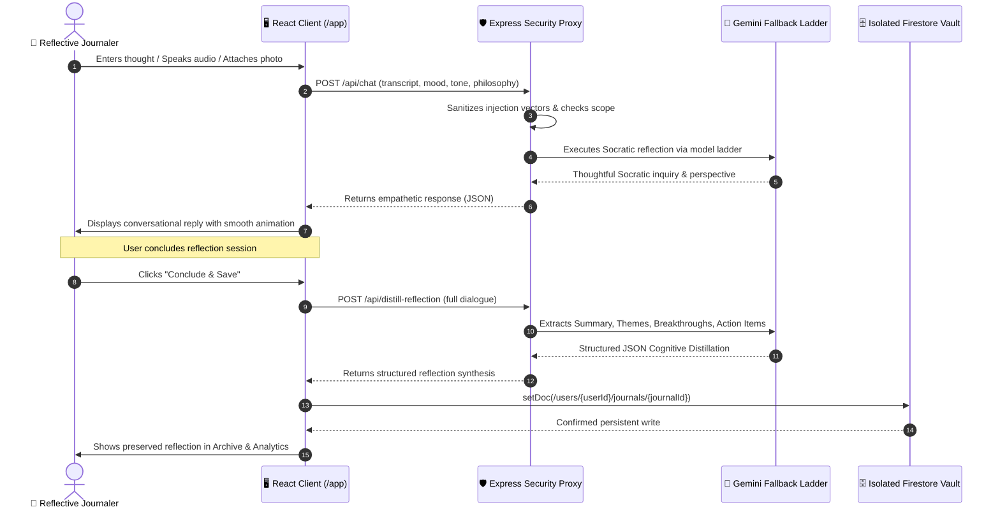
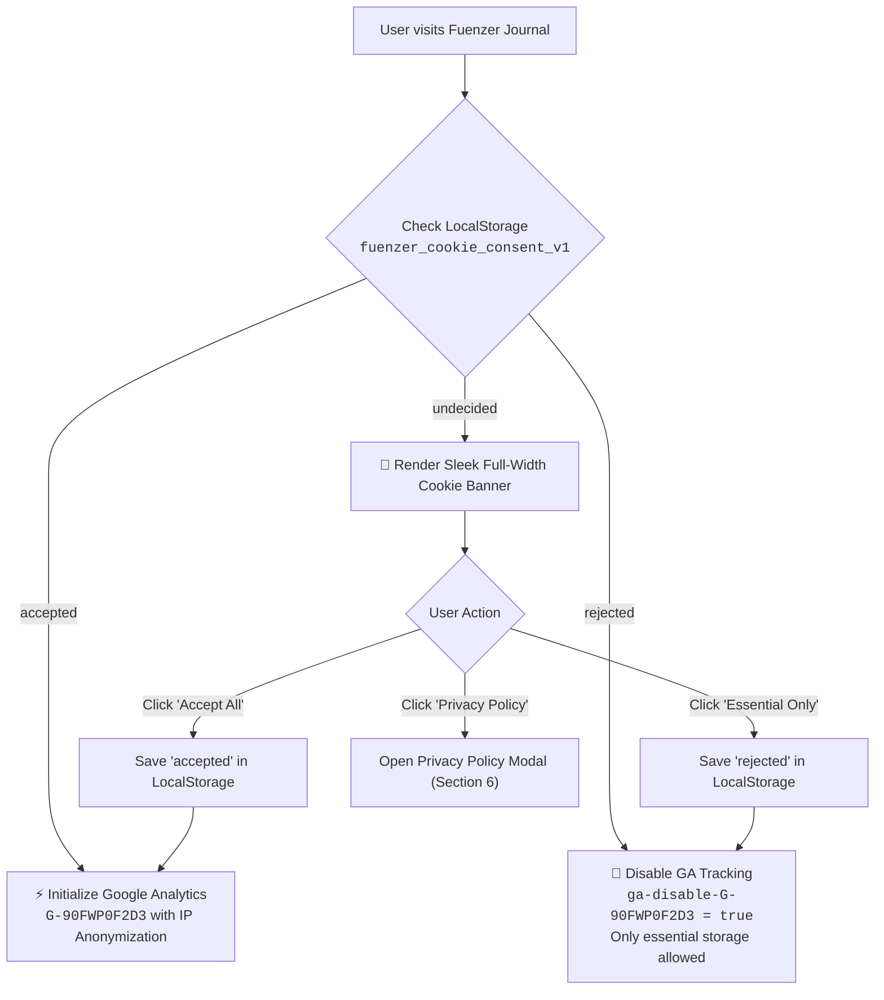

# Fuenzer Journal

> **Your Private Sanctuary for Mindful Multi-Turn Reflection, Socratic Clarity, and Personal Growth.**  
> Built with **React 19**, **TypeScript**, **Tailwind CSS v4**, **Cloud Firestore**, **Firebase Authentication**, **Google Analytics**, and the **Gemini API** (`@google/genai`).

<!-- Tech Stack Badges -->
[](https://react.dev/)
[](https://www.typescriptlang.org/)
[](https://vitejs.dev/)
[](https://tailwindcss.com/)
[](https://expressjs.com/)
[](https://ai.google.dev/)
[](https://firebase.google.com/docs/firestore)
[](https://firebase.google.com/docs/auth)
[](https://analytics.google.com/)
[](https://cloud.google.com/run)
[](https://motion.dev/)
[](https://lucide.dev/)
[](https://recharts.org/)
[](https://parall.ax/products/jspdf)
[](https://opensource.org/licenses/Apache-2.0)

<!-- Social Badges -->
[](https://github.com/Yogs4R/fuenzer-journal)
[](https://linkedin.com/in/ridwansuryantara)
[](mailto:fuenzerofficial@gmail.com)

---

## 🌐 Live Production & Domain Endpoints

- **Primary Application URL**: [https://fuenzer-journal.ai.studio](https://fuenzer-journal.ai.studio)
- **Personal Branding Subdomain**: [https://journal.fuenzer.web.id](https://journal.fuenzer.web.id)
- **LLMs / Generative Engine Optimization (GEO) Manifest**: [https://fuenzer-journal.ai.studio/llms.txt](https://fuenzer-journal.ai.studio/llms.txt)
- **XML Sitemap**: [https://fuenzer-journal.ai.studio/sitemap.xml](https://fuenzer-journal.ai.studio/sitemap.xml)

---

## 📑 Table of Contents

1. [🌿 Overview (What is Fuenzer Journal?)](#-overview-what-is-fuenzer-journal)
2. [🌟 Key Features & Capabilities](#-key-features--capabilities)
3. [🏛️ Architecture & Mermaid System Flowcharts](#️-architecture--mermaid-system-flowcharts)
4. [🍪 Privacy-First Cookie System & Google Analytics (G-90FWP0F2D3)](#-privacy-first-cookie-system--google-analytics-g-90fwp0f2d3)
5. [🤖 Generative Engine Optimization (GEO) & SEO Infrastructure](#-generative-engine-optimization-geo--seo-infrastructure)
6. [🛡️ Agentic Threat Modeling & Security Directives](#️-agentic-threat-modeling--security-directives)
7. [🔐 Database Security Configuration (`firestore.rules`)](#-database-security-configuration-firestorerules)
8. [🚀 Production Deployment to Google Cloud Run](#-production-deployment-to-google-cloud-run)
9. [🧪 Functional Stability & Comprehensive User Test Walkthroughs](#-functional-stability--comprehensive-user-test-walkthroughs)
10. [💻 Local Development & Setup](#-local-development--setup)
11. [📬 Contact & Socials](#-contact--socials)

---

## 🌿 Overview (What is Fuenzer Journal?)

**Fuenzer Journal** is an intelligent, privacy-first personal sanctuary designed to transform introspective journaling into a calm, conversational dialogue. Rather than confronting an intimidating blank page, you are guided by a supportive Socratic AI companion that helps untangle complex emotions, separate what is in your control from what isn't, and reframe unhelpful thought patterns.

### Core Philosophy & Highlights
- 🧘 **Conversational Socratic Inquiries**: Socratic prompts challenge cognitive distortions and guide deep introspection without feeling transactional.
- 🎙️ **Multimodal Voice & Image Reflections**: Speak freely with real-time speech-to-text dictation and attach up to 5 photos or sketches (<5 MB each) with full-screen lightbox preview.
- ⚡ **Automated Cognitive Distillation**: Automatically extracts executive summaries, core philosophical themes, key breakthroughs, and actionable to-do items.
- 📖 **Distraction-Free Focus & Reading Mode**: Read past reflections in a pure, book-like view with zero toolbar clutter.
- 📅 **Real-World Calendar Heatmap**: Accurate monthly calendar supporting all past, present, and future years (including even years like 2024, 2028, and leap year days), with fast month/year selectors.
- 🛡️ **100% Client-Side Privacy Export**: Export full archives or single entries to PDF, CSV Spreadsheets, Markdown digests, or JSON raw backups directly in the browser with zero external server dependencies.
- 🔒 **Zero Public Data Monetization**: User journals are protected by owner-bound Firestore security rules and are never used to train public foundation models.

---

## 🌟 Key Features & Capabilities

### 1. Socratic Reflection Frameworks
- **Stoic Reflection** — Dichotomy of control and tranquil equanimity.
- **Daily Gratitude** — Mindful appreciation for small victories and relationships.
- **CBT Cognitive Reframe** — Identifying and reframing all-or-nothing thinking, catastrophizing, and mental filters.
- **Weekly Retrospective** — Analyzing wins, friction points, and growth trajectories.
- **Future Self Visioning** — Aligning daily decisions with long-term aspirations.
- **Creative Free-Flow** — Open stream of consciousness for free-form introspection.

### 2. Focus & Reading Mode in Archive
- Switch between standard inspection view and pure **Focus / Reading Mode** with an unobtrusive top exit bar for immersive reading.

### 3. Real-World Calendar Heatmap & Analytics
- Complete month/year navigation with quick jump dropdowns covering **2020 through 2032** (all odd and even years).
- Dynamic leap year indicator (`29 Days in February`).
- Interactive tooltips displaying daily word counts, entry counts, and dominant emotional states.

### 4. Interactive Action Items & To-Do Tracking
- Extracted next action steps feature interactive checkboxes that immediately synchronize completion status with Firestore.

### 5. Multi-Format Client-Side Data Export
- **PDF Export**: Print-ready documents generated with `jspdf`.
- **CSV Spreadsheet**: Compatible with Excel and Google Sheets, including mood scores and cognitive distortions.
- **JSON Backup**: Raw, structured, zero-loss backups.
- **Markdown Digest (.MD)**: Formatted for Obsidian, Notion, or local text editors.

---

## 🏛️ Architecture & Mermaid System Flowcharts

### 1. High-Level Project Architecture



---

### 2. Multi-Turn Socratic AI Reflection & Synthesis Flow



---

### 3. Cookie Consent & Analytics Gate Flow



---

## 🍪 Privacy-First Cookie System & Google Analytics (`G-90FWP0F2D3`)

Fuenzer Journal implements an **explicit, opt-in cookie consent architecture**:
- **Full-Width Bottom Banner**: Unobtrusive, responsive design matching light and dark themes.
- **Choice Architecture**: Users can click **"Accept All"** or **"Essential Only"**.
- **Google Analytics Integration**: Tag `G-90FWP0F2D3` is initialized **only after affirmative consent** with `anonymize_ip: true` and `SameSite=None;Secure` cookie flags.
- **Zero Advertising Trackers**: No third-party ad networks, tracking pixels, or cross-site fingerprinting scripts exist in the codebase.
- **Always Accessible Preferences**: Users can reset or change their cookie choices anytime from the footer **"Cookie Preferences"** link.

---

## 🤖 Generative Engine Optimization (GEO) & SEO Infrastructure

To ensure optimal indexing by search engines and generative AI agents (Perplexity, ChatGPT, Gemini, Claude):

| Resource | Path | Description |
|---|---|---|
| **Robots Exclusion** | `/public/robots.txt` | Allows all major search bots and explicitly whitelists AI crawlers (`GPTBot`, `Google-Extended`, `ClaudeBot`, `PerplexityBot`). |
| **XML Sitemap** | `/public/sitemap.xml` | Multi-domain sitemap indexing both `https://fuenzer-journal.ai.studio` and `https://journal.fuenzer.web.id`. |
| **LLMs Context Manifest** | `/public/llms.txt` | Standardized GEO markdown specification defining features, frameworks, and architecture for AI agents. |
| **Full LLM Reference** | `/public/llms-full.txt` | In-depth technical and philosophical specification for deep AI reasoning. |
| **Schema.org Structured Data** | `/index.html` | `WebApplication` & `SoftwareApplication` JSON-LD schema with features list and multi-domain links. |

---

## 🛡️ Agentic Threat Modeling & Security Directives

In accordance with OWASP Top 10 for Web Applications and OWASP Top 10 for LLM Applications:

| Threat Zone | Identified Risk | Countermeasure Implemented |
|---|---|---|
| **Input Surfaces** | Malicious injection, oversized payloads, prompt hijacking | Defensive schema parsing, client-side & server-side string clamping, HTML character encoding. |
| **Planning & Reasoning** | Prompt injection attempting to alter system role or leak other users' data | Regex-based injection detection in backend routes, context-bounded prompt templates, plain text ingestion. |
| **Out-of-Scope Misuse** | Utility requests outside reflection (e.g. coding scripts, cooking recipes) | Server-side regex intent interceptor that politely guides users back to mindfulness. |
| **Tool Execution & Billing** | DDoS, API exhaustion, billing spikes | Sliding-window per-IP rate limiter on backend API endpoints (40 requests/min). |
| **Memory & State** | Cross-user journal data exposure | Strict owner-bound Firestore Security Rules matching `request.auth.uid == userId`. |
| **Inter-System / API** | API key leakage to browser client | Gemini API key strictly confined to server-side routes; fallback model ladder catches API quotas cleanly. |

---

## 🔐 Database Security Configuration (`firestore.rules`)

```javascript
rules_version = '2';
service cloud.firestore {
  match /databases/{database}/documents {
    // User profile metadata
    match /users/{userId} {
      allow read, write: if request.auth != null && request.auth.uid == userId;
    }

    // Owner-bound journal entries isolation
    match /users/{userId}/journals/{journalId} {
      allow read, write: if request.auth != null && request.auth.uid == userId;
    }

    // Default deny for all other collections
    match /{document=**} {
      allow read, write: if false;
    }
  }
}
```

---

## 🚀 Production Deployment to Google Cloud Run

### 1. Prerequisites & GCP Setup
```bash
# Set active GCP project
gcloud config set project YOUR_PROJECT_ID

# Enable required Google Cloud APIs
gcloud services enable \
  run.googleapis.com \
  secretmanager.googleapis.com \
  firestore.googleapis.com \
  cloudbuild.googleapis.com
```

### 2. Secret Manager Configuration
Store your Gemini API key securely in Google Cloud Secret Manager:
```bash
# Create and populate secret
gcloud secrets create GEMINI_API_KEY --replication-policy="automatic"
echo -n "YOUR_GEMINI_API_KEY" | gcloud secrets versions add GEMINI_API_KEY --data-file=-

# Grant Cloud Run runtime service account access
PROJECT_NUMBER=$(gcloud projects describe YOUR_PROJECT_ID --format="value(projectNumber)")
gcloud secrets add-iam-policy-binding GEMINI_API_KEY \
  --member="serviceAccount:${PROJECT_NUMBER}-compute@developer.gserviceaccount.com" \
  --role="roles/secretmanager.secretAccessor"
```

### 3. Deploy to Cloud Run
```bash
# Build and deploy containerized service
gcloud run deploy fuenzer-journal \
  --source . \
  --region us-central1 \
  --allow-unauthenticated \
  --set-secrets GEMINI_API_KEY=GEMINI_API_KEY:latest

# Apply challenge verification label
gcloud run services update fuenzer-journal \
  --update-labels=dev-tutorial=cloud-run-ai-challenge \
  --region=us-central1
```

---

## 🧪 Functional Stability & Comprehensive User Test Walkthroughs

The following test cases map every user-facing interaction for automated testing tools and manual verification:

### Test Case 1: Sticky Navigation Bar
1. Navigate to `/app`, `/archive`, or `/insights`.
2. Scroll down through long journal lists, analytics charts, or multi-turn reflection dialogues.
3. Verify that the navigation bar remains pinned to the top of the viewport with a frosted glass backdrop effect (`backdrop-blur-md`).

### Test Case 2: Multi-Turn Socratic AI Reflection & Fallback Model Ladder
1. Navigate to `/app` (Reflection Studio).
2. Type a message (e.g., `"I felt overwhelmed by work deadlines today"`) and press **Cmd+Enter** or click **Send**.
3. Verify that the AI generates an empathetic Socratic reflection within 2 seconds.
4. Verify that sending further messages builds a multi-turn reflection transcript seamlessly.

### Test Case 3: Focus & Reading Mode in Archive
1. Navigate to `/archive` and click on any preserved journal entry.
2. Click the **Focus Mode** button in the top action bar.
3. Verify all editing controls, toolbars, and metadata sidebars are hidden, rendering the reflection text in a clean, distraction-free reading typography.
4. Click **Exit Focus** to return to standard view.

### Test Case 4: Real-World Calendar Heatmap & Year/Month Selectors
1. Navigate to `/insights`.
2. Locate the Heatmap Calendar card.
3. Select an even year like **2024** or **2028** and choose **February**.
4. Verify that the badge displays `Leap Year • 29 Days` with exactly 29 day cells rendered.
5. Click **Next Month (`>`)**, **Prev Month (`<`)**, **Next Year (`>>`)**, and **Prev Year (`<<`)** to confirm smooth calendar navigation.
6. Click **Today** to instantly return to the current month and year.

### Test Case 5: Voice Dictation & Multimodal Image Attachment
1. Click the **Microphone** icon in the reflection input bar.
2. Grant browser microphone access and speak aloud.
3. Verify that transcribed voice text streams directly into the reflection textarea. Click the microphone icon again to stop.
4. Click the **Image Attachment** icon or drag and drop up to 5 image files (<5 MB each).
5. Verify thumbnail preview badges render with file sizes.
6. Click any image thumbnail to trigger the full-screen lightbox zoom view.
7. Click the **X** button on a thumbnail to remove it.

### Test Case 6: Draft Chat Auto-Persistence & Navigation Survival
1. In `/app`, start a new reflection and type two back-and-forth messages.
2. Without saving, click **Archive** (`/archive`) or **Insights** (`/insights`) in the navigation bar.
3. Return to `/app` (`Reflection Studio`).
4. Verify that the chat transcript, selected framework, and feeling mood chips are completely preserved and not lost.

### Test Case 7: Cookie Consent & Google Analytics Activation
1. Clear browser cookies/localStorage or open an incognito window.
2. Verify that the sleek full-width Cookie Banner appears at the bottom of the screen.
3. Click **"Accept All"**; verify that Google Analytics (`G-90FWP0F2D3`) is initialized and the banner dismisses.
4. Click **"Cookie Preferences"** in the footer to reset preferences, reload, and choose **"Essential Only"**; verify that `ga-disable-G-90FWP0F2D3` is set to `true`.

### Test Case 8: Interactive To-Do Lists (Task Check/Uncheck)
1. In `/archive`, click on a journal entry that contains Action Items.
2. Click on the checkbox next to any action item.
3. Verify the item toggles immediately with strikethrough styling and syncs to Firestore (`updateJournalActionItems`).
4. Close and re-open the modal to confirm the checked state was persisted.

### Test Case 9: Multi-Format Client-Side Export (PDF, CSV, JSON, Markdown)
1. In `/archive` or `/insights`, click the **Export** button.
2. Verify that the export menu provides:
   - **PDF Report / Archive Digest**
   - **Spreadsheet (CSV)**
   - **Full Backup (JSON)**
   - **Markdown Digest (.MD)**
3. Select each format and verify that the file downloads instantly in the browser without external network calls.

### Test Case 10: Light & Dark Theme Switching
1. Click the **Sun/Moon** icon in the navbar (or open the mobile hamburger drawer and toggle theme).
2. Verify the entire UI switches between the warm sanctuary cream theme and eye-safe deep neutral dark mode (`#181814`, `#23231c`).
3. Refresh the page and confirm the theme preference persists via `localStorage`.

---

## 💻 Local Development & Setup

```bash
# 1. Clone repository
git clone https://github.com/Yogs4R/fuenzer-journal.git
cd fuenzer-journal

# 2. Install dependencies
npm install

# 3. Configure environment variables
cp .env.example .env.local
# Add your Firebase and Gemini API keys

# 4. Start development server
npm run dev
```
Open [http://localhost:3000](http://localhost:3000) to access the application.

---

## 📬 Contact & Socials

- **Author**: Ridwan Suryantara
- **GitHub**: [https://github.com/Yogs4R/fuenzer-journal](https://github.com/Yogs4R/fuenzer-journal)
- **LinkedIn**: [https://linkedin.com/in/ridwansuryantara](https://linkedin.com/in/ridwansuryantara)
- **Email**: [fuenzerofficial@gmail.com](mailto:fuenzerofficial@gmail.com)
- **License**: Apache-2.0
